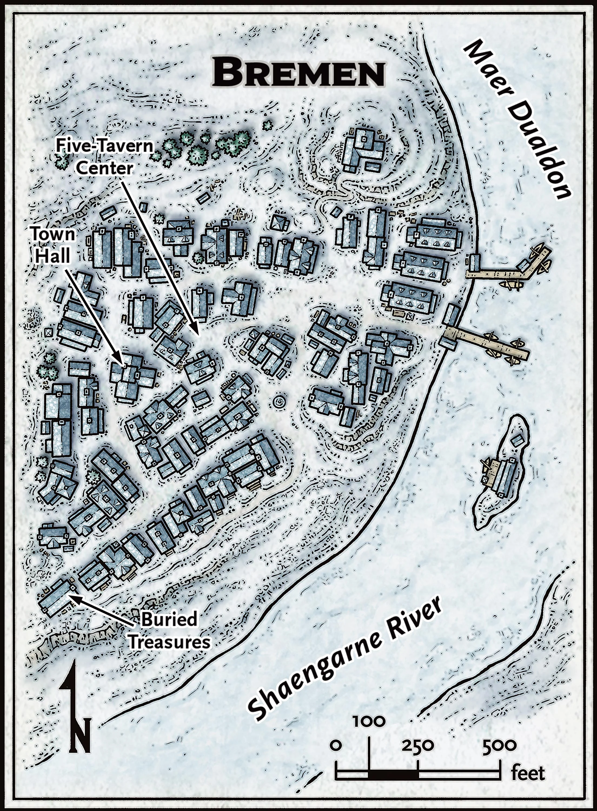
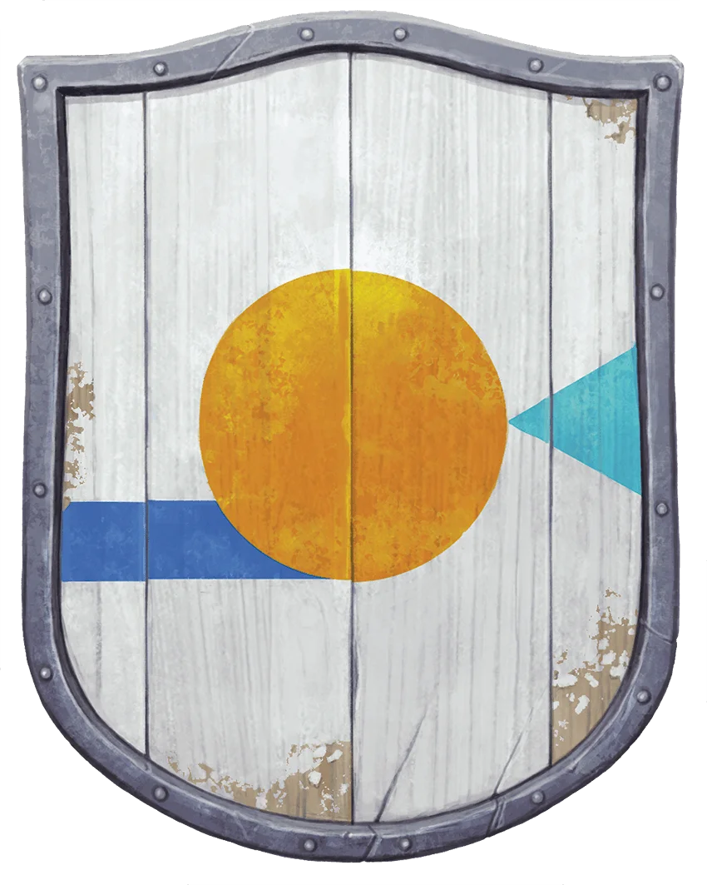

# Bremen

## In a Nutshell

- **Friendliness** ❄❄❄**Services** ❄**Comfort** ❄❄
- **Population**: 150
- **Leaders**: Speaker [Dorbulgruf Shalescar](../characters/Dorbulgruf%20Shalescar.md)
- **Militia**:
- **Sacrifice to Auril**: Warmth

## Heraldry

A gold circle on a white field, with a horizontal blue band extending to the left under the circle, and a flaring blue triangle opening away from the circle on the right. The gold circle represents treasure found in the wake of local floods, the blue band is the Shaengarne River, the blue triangle is Maer Dualdon, and the white field represents snow.

{: .m-image }

## Connections

Heavy snow has obliterated a trail that once guided travelers to Targos. Adventurers determined to make the journey on foot can reach Targos in 2 hours. Using mounts or dogsleds can reduce this travel time by as much as 50 percent.

### Overland Travel from Bremen

| To         | Travel Time |
| ---------- | ----------- |
| Targos     | 2 hours     |

### Locations in Bremen
