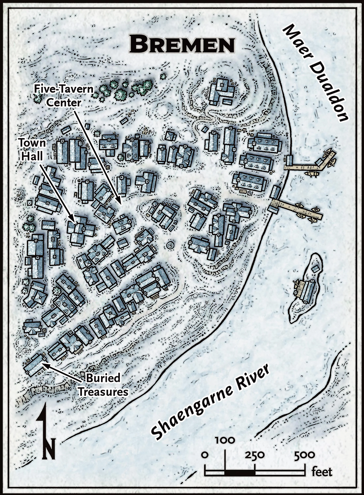
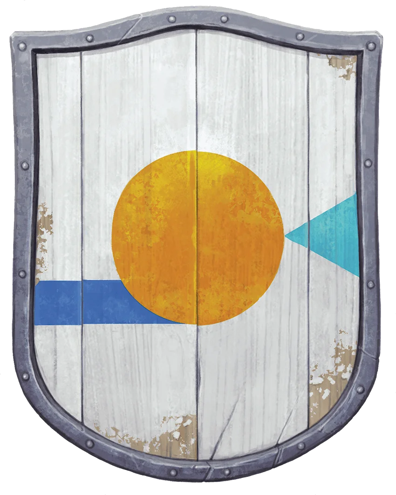

# Bremen

## In a Nutshell

- **Friendliness** ❄❄❄**Services** ❄**Comfort** ❄❄
- **Population**: 150
- **Leaders**: Speaker [Dorbulgruf Shalescar](../characters/Dorbulgruf%20Shalescar.md)
- **Militia**:
- **Sacrifice to Auril**: Warmth

## Heraldry

A gold circle on a white field, with a horizontal blue band extending to the left under the circle, and a flaring blue triangle opening away from the circle on the right. The gold circle represents treasure found in the wake of local floods, the blue band is the Shaengarne River, the blue triangle is Maer Dualdon, and the white field represents snow.

{: .m-image }

## Connections

Heavy snow has obliterated a trail that once guided travelers to Targos. Adventurers determined to make the journey on foot can reach Targos in 2 hours. Using mounts or dogsleds can reduce this travel time by as much as 50 percent.

### Overland Travel from Bremen

| To         | Travel Time |
| ---------- | ----------- |
| Targos     | 2 hours     |

### Locations in Bremen

- **Buried Treasures** — the town inn, and the first door the party walked through on arrival. Speaker [Dorbulgruf Shalescar](../characters/Dorbulgruf%20Shalescar.md) keeps a table here and introduced himself by thumping his chest.
- **The town hall records room** — a single sparse shelf, but enough. [Hobbins](../characters/Hobbins.md) found _Nature and the Divine_ on it and learned how divine energy and godlings work.
- **An expedition shack** — a weather-beaten outfitter at the edge of town with an elderly owner, a pipe, and a sled one hard turn from becoming firewood. [Aronious](../characters/Aronious.md) bought half ownership of that sled for one gold rather than renting it; [Hobbins](../characters/Hobbins.md) refused to ride it and commissioned a fresh build from a local carpenter for eight.
