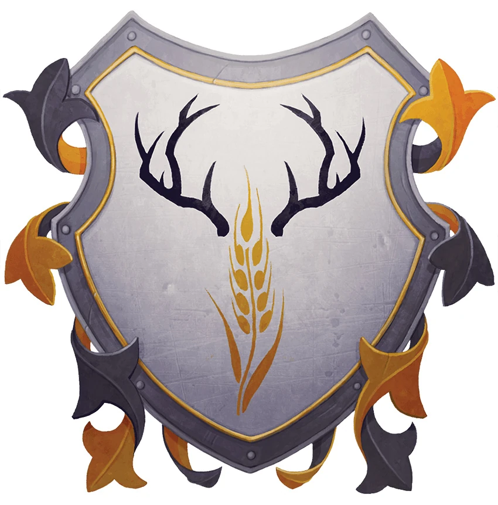

## In a Nutshell

- **Friendliness** ❄❄❄ **Services** ❄❄❄ **Comfort** ❄❄❄
- **Population**: 1200
- **Leaders**: Speaker Duvessa Shane
- **Militia**: Roughly 250 soldiers and 20 officers
- **Sacrifice to Auril**: Human

## Heraldry

Black antlers above a vertical shaft of golden wheat on a white field, signifying the town's strength and prosperity on the vast, snowy tundra.

{: .m-image }

## Connections

Bryn Shander is connected to Easthaven by the Eastway, a snow-covered road. In addition, there are snowy paths to Caer-Dineval, Good Mead, Targos, and Termalaine. Travel times in the Overland Travel from Bryn Shander table assume that characters are on foot; mounts and dogsleds can shorten these times by as much as 50 percent.

### Overland Travel from Bryn Shander

| To           | Travel Time |
| ------------ | ----------- |
| Caer-Dineval | 10½ hours   |
| Easthaven    | 7½ hours    |
| Good Mead    | 6 hours     |
| Targos       | 2 hours     |
| Termalaine   | 6 hours     |

## Locations in Bryn Shander

- [Blackiron Blades](Blackiron%20Blades.md)
- [The Northlook Inn](The%20Northlook%20Inn.md)
<!-- - [[House of the Morninglord]] -->
