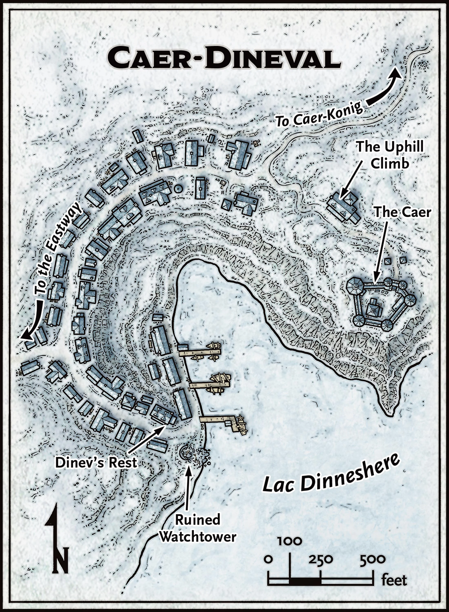

## In a Nutshell

- **Friendliness** ❄❄**Services** ❄**Comfort** ❄
- **Population**: 100
- **Leaders**: Speaker [Crannoc Siever](../characters/Crannoc%20Siever.md)
- **Militia**:
- **Sacrifice to Auril**: Food

## Heraldry

A crenellated stone watchtower (three merlons, two crenellations) on a dark blue field, with a horizontal red fish facing right beneath the tower, representing the town's vigilance, harbor, and proud fishing tradition.

{: .m-image }

## Connections

A snow-covered path leads from Caer-Dineval to the Eastway. Other paths lead to Caer-Konig and Good Mead. Travel times in the Overland Travel from Caer-Dineval table assume that characters are on foot; mounts and dogsleds can shorten these times by as much as 50 percent.

### Overland Travel from Caer-Dineval

| To           | Travel Time |
| ------------ | ----------- |
| Bryn Shander | 10½ hours   |
| Caer-Konig   | 2 hours     |
| Good Mead    | 8 hours     |
| Easthaven    | 9 hours     |

### Locations in Caer Dineval

- [The Uphill Climb](The%20Uphill%20Climb.md)