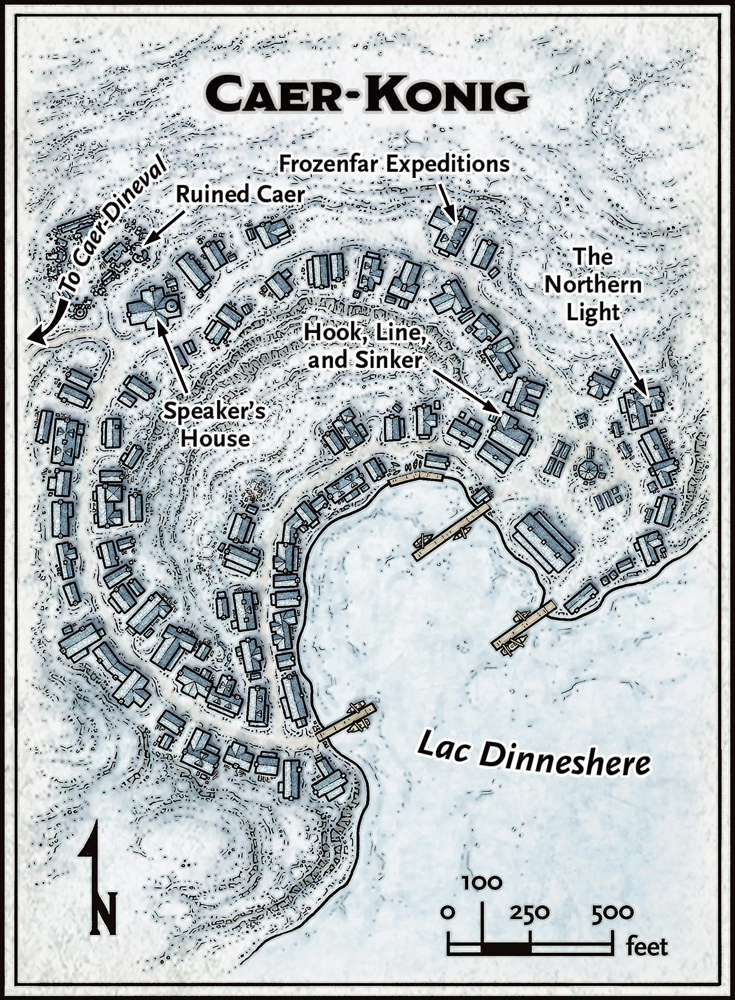
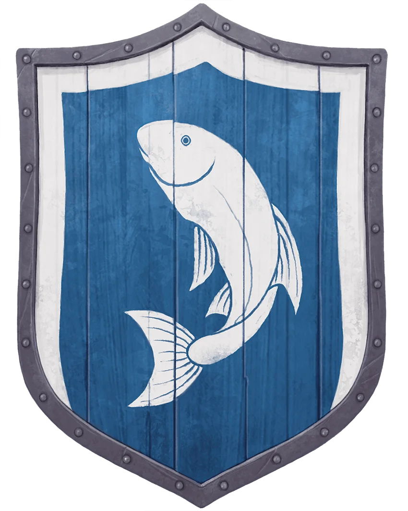

# Caer-Konig

## In a Nutshell

- **Friendliness** ❄❄**Services** ❄❄**Comfort** ❄❄❄
- **Population**: 150
- **Leaders**: Speaker [Torvus](../characters/Torvus.md)
- **Militia**:
- **Sacrifice to Auril**: Food

## Heraldry

A white fish silhouette rising from the center bottom of a dark blue field, which has a white border on all sides but its bottom. The fish signifies the local fishing trade, and the broken border represents the snow and the harbor surrounding the town.

{: .m-image }

## Connections

A three-mile-long, snow-covered path links Caer-Konig to the neighboring town of Caer-Dineval. Characters on foot can walk this path in 2 hours; mounts and dogsleds can shorten this time by as much as 50 percent.

### Overland Travel from Caer-Konig

| To         | Travel Time |
| ---------- | ----------- |
| Caer-Dineval | 2 hours     |

### Locations in Caer-Konig

- [The Northern Light](../world/atlas/The%20Northern%20Light)
- [Frozenfar Expeditions](../world/atlas/Frozenfar%20Expeditions)