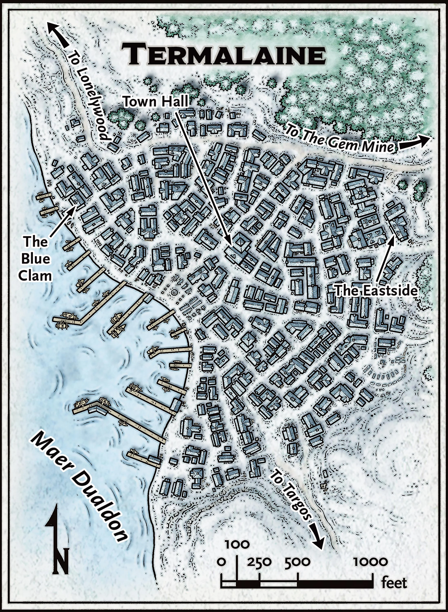
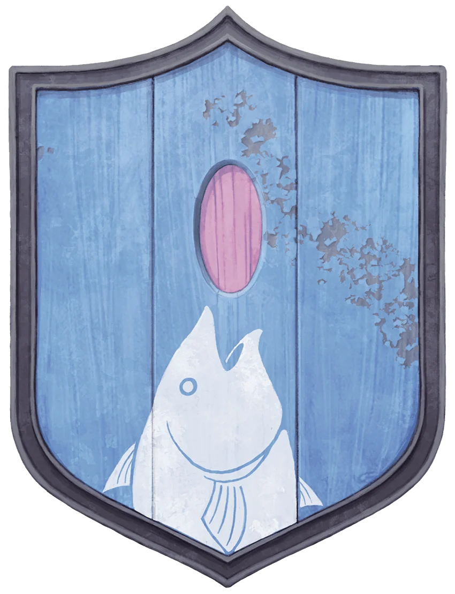

# Termalaine

## In a Nutshell

- **Friendliness** ❄❄❄**Services** ❄❄**Comfort** ❄❄❄
- **Population**: 600
- **Leaders**: Speaker [Oarus Masthew](../characters/Oarus%20Masthew.md)
- **Militia**: 50 soldiers
- **Sacrifice to Auril**: Warmth

## Heraldry

The open-mouthed head of a fish at the bottom of a sky-blue field, its jaws parted as it swallows a large rose-pink oval. The oval is a tourmaline, symbolic of the town's gem mining.

{: .m-image }

## Connections

Snow-covered paths connect Termalaine to Lonelywood and Targos, its closest neighbors. Travel times in the Overland Travel from Termalaine table assume that characters are on foot; mounts and dogsleds can shorten these times by as much as 50 percent.

### Overland Travel from Termalaine

| To         | Travel Time |
| ---------- | ----------- |
| Targos     | 4 hours     |
| Lonelywood | 2 hours     |

### Locations in Termalaine

- [The Mines](Termalaine%20Mines.md) — gem workings running deep under the town, around a central shaft with no apparent bottom and a waterfall somewhere below it. Kobolds moved in and miners went missing; a sign at the entrance read _NO ENTRY — KOBOLDS ONLY_ in handwriting far too precise to belong to any miner. The party cleared it, freed the kobolds from the ghost steering them, and the mine now works a kobold crew paid in food and lodging.
- **The mining offices** — [Foreman Lancastor](../characters/Foreman%20Lancastor.md)'s desk, and the mine's own appraiser, a wiry balding man with a nasal voice who valued a single tunnel-wall gemstone at close to a hundred gold.
- **The armorer** — a dragonborn named [Karthax](../characters/Karthax.md), who cured a set of grell tentacles and lashed them into a serviceable whip overnight.
