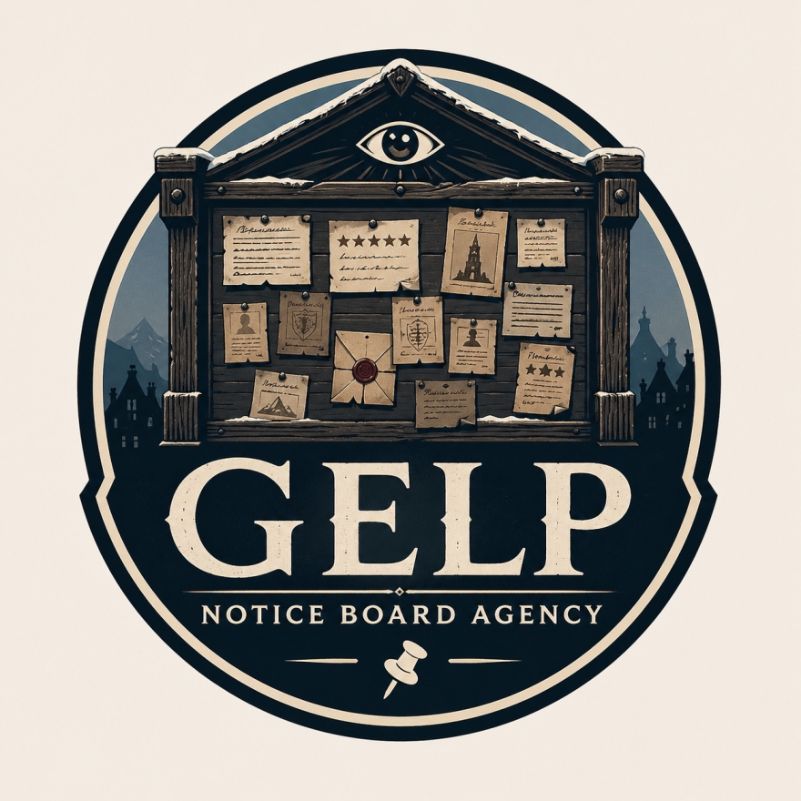

# Gelp

_Notice Board Agency_

{: .m-image }

No one remembers when the first board appeared.

That is the part that unsettles people most, when they stop to think about it — which most don't, because the boards are useful, and useful things tend to stop being questioned. One morning a board was simply there, bolted to a post outside the inn at [Bryn Shander](../atlas/Bryn%20Shander.md), and within a week there was one in every town across Ten-Towns. Sturdy. Weatherproofed. Unmarked by any craftsman's seal or merchant's brand.

Towners post to them freely. Grievances, praises, warnings, and recommendations appear in a dozen different hands — ink on parchment, charcoal on bark, wax-sealed letters pinned with care. Fetch requests and odd jobs find their way onto the boards alongside adventurer contracts, missing person notices, and the occasional scathing review of a meal that did not meet expectations. [Aronious](../characters/Aronious.md) has been known to leave them.

After some days, older postings vanish. Not torn down — simply gone, cleanly, as though they were never fixed there. The space fills again.

The deeper strangeness is this: a traveler who mutters a complaint about a leaking roof to no one in particular may find their words, precisely recorded and assigned a rating of one star, on the board the following morning. An offhand compliment to a cook, a remark made in passing to a companion — these too have been known to appear, attributed and dated, as though someone were always listening and always taking notes.

No one has seen who maintains the boards. No one has caught them being restocked, repaired, or read. 

Most people in Ten-Towns have simply decided not to look too hard at the question. The boards work. The cold is already enough to worry about.